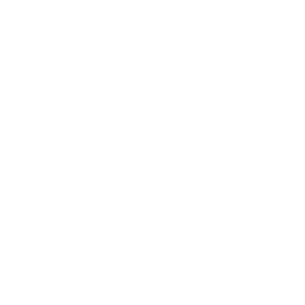

# Assets

All the assets shown below have been developed by myself.

## Dice

Each of the assets below represents the 1 of the 6 possible dice results.

| 1 Point | 2 Points | 3 Points | Attack | Health | Currency |
|-|-|-|-|-|-|
|  |  |  |  |  |  |

## Kittens

The 'Base' asset below represents the background for every kitten, which can take on any colour, and the rest of the assets represents the outline which is applied to that kitten, giving a large variety of kittens to play as.

| Base | Standard | Beard | Dark | Super | Robo | Stylish Winter | Zombie |
|-|-|-|-|-|-|-|-|
|  |  |  |  |  |  |  |  |

## Other

The 'Castle' asset is used as eponymous the Castle of which the kittens vie for control. The 'Sun' and 'Moon' assets are used to add flavour to the sky background. The 'Potential New Player UI' image is an alternate, compact way of showing information about each player, still in development.

| Castle | Sun | Moon | Potential New Player UI |
|-|-|-|-|
|  |  |  |  |
