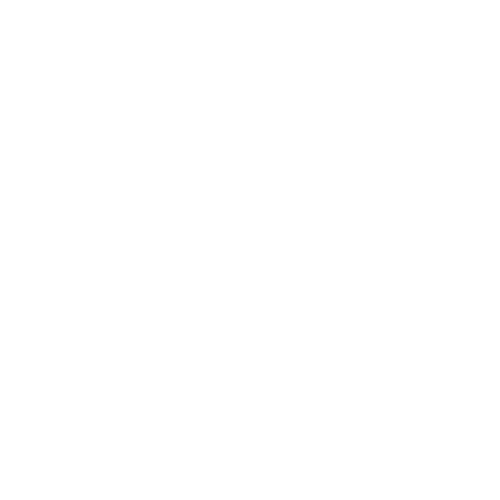
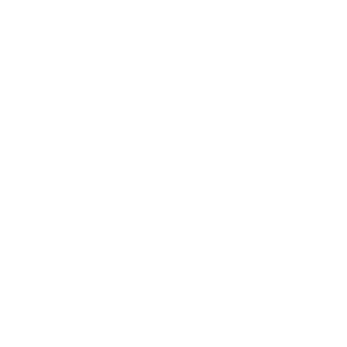
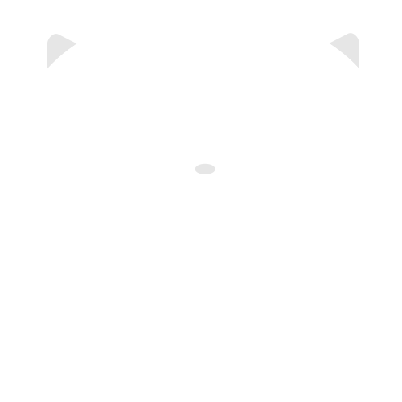
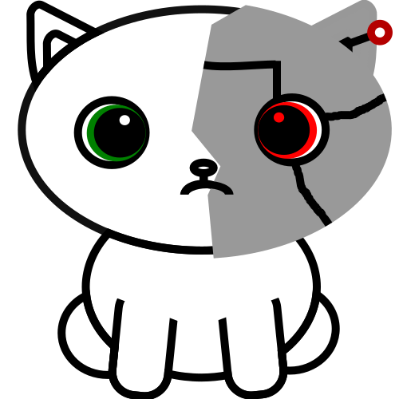
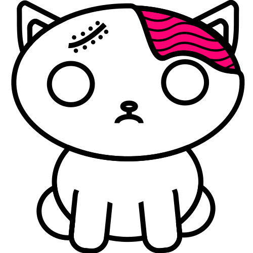

# Assets

## Dice
|-|-|-|-|-|-|
|-|-|-|-|-|-|
|  |  |  |  |  |  |

## Kittens
| Base | Standard | Beard | Dark | Super | Robo | Stylish Winter | Zombie |
|-|-|-|-|-|-|-|-|
|  |  |  |  |  |  |  |  |
